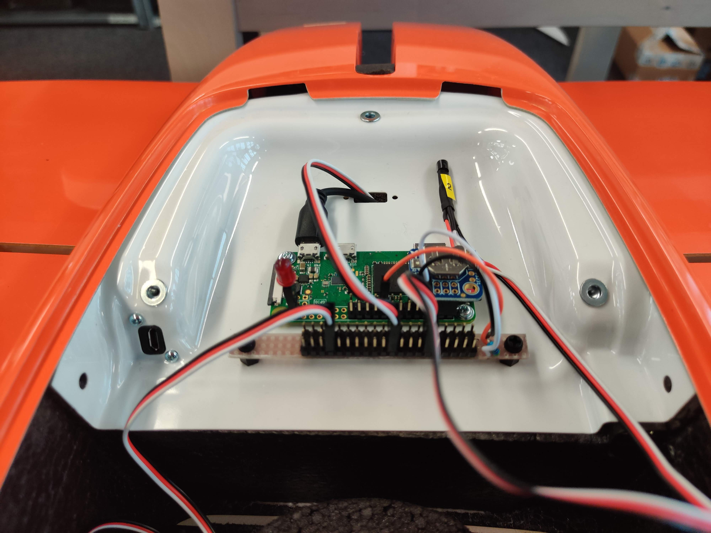
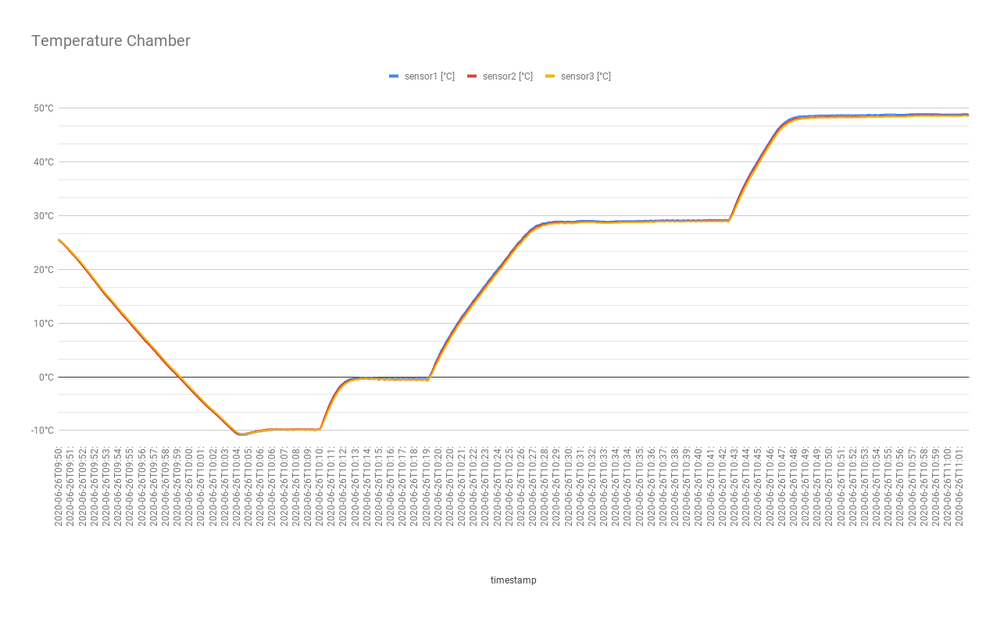

# TempDAQ
Data Acquisition (DAQ) for 1-wire temperature sensors like the digital sensor [DS18S20](https://www.adafruit.com/product/374) or [the thermocouple adapter MAX31850K](https://www.adafruit.com/product/1727). The TempDAQ was developed as part of an internship at [Wingtra](https://wingtra.com/) by [Jonas Lauener](https://www.jolau.ch/).  

Copyright (c) 2020, Jonas Lauener & Wingtra AG\
[](https://opensource.org/licenses/MPL-2.0)



## Hardware
- Raspberry Pi
- Up to 20 sensor can be connected 
    - The number of connected sensors influences the sampling rate - with three sensors it takes around 1.03 seconds per reading of all sensors.
- [DS18S20](https://www.adafruit.com/product/374): The IC sensor also showed in the picture above:
    - Measures Temperatures from -55°C to +125°C
    - ±0.5°C Accuracy from -10°C to +85°C
    - Resolution is 0.0625°C
- [Features a status LED](#status-led)

### Pinout Raspberry Pi

- Black cable: GND (pin 9)
- Orange cable: 3V3 (pin 17)
- White cable: 1-wire (pin 7)

## Installation
_In case you want to setup your own TempDAQ on a Raspberry Pi:_
1. Enable 1-Wire support as described here: https://learn.adafruit.com/adafruits-raspberry-pi-lesson-11-ds18b20-temperature-sensing/ds18b20
2. Run: `pip3 install -r requirements.txt`

### Enable/Disable Autostart
1. Edit temp_daq.py and temp_daq_config.yaml paths in temp_daq.service file to your own needs 
2. `sudo systemctl enable [full path to temp_daq.service file]`    
    This automatically links the service and enables it. Replace `enable` with `disable` to disable service.

## Usage
Start with `python3 temp_daq.py [full path to temp_daq_config.yaml]`

**Important: you need to reboot the Raspberry Pi if you replug sensors!**

The app logs _all connected_ sensors, but if the sensor id is added to the config file, 
the configured name will be used for logging. 

### Get sensor id
1. Plug in **exclusively** the sensor you want to identify
2. The bash command `w1thermsensor ls` lists the _HWID_ and _Type_ of the sensor
3. Enter the _HWID_ in the temp_daq_config.yaml

### Status led
If the status led is enabled in config, it will glow when running:
- Constant glow: app is started, but not yet fully initialized
- Slow blinking (on time=1s, off time=1s): app is running normally, waiting for next acquisition
- Fast blinking (on time=0.1s, off time=0.1s): temperature acquisition is happening

## Config file
Short primer on syntax of yaml: https://learnxinyminutes.com/docs/yaml/

### Example config with explanation
```yaml
storage_directory: "/home/pi/Documents/temp_daq/" # directory where to put output csv files
interval: 10 # log temperature every [x] seconds. If a read-out takes longer as the interval time, the next read-out will be skipped.
status_led: true # enable/disable status led, blinks every time a vibration file is written
status_led_pin: 21  # only read if status_led == true
sensors: 
  - name: sensor1 # name of sensor which is used for the output csv
    id: 00000c43b797 # id of sensor
  - name: sensor2
    id: 00000c43ed7d
```

## Example data
### Temperature Chamber
To see how accurate the sensors are, I've put them in the temperature chamber. The chamber did the temperatures -10°C, 0°C, 30°C and 50°C.
- [Temperature chamber raw data](docs/temp_data_2020-06-26T09_36_41.csv) \

